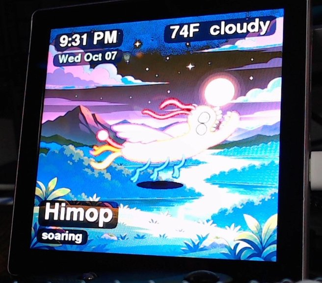
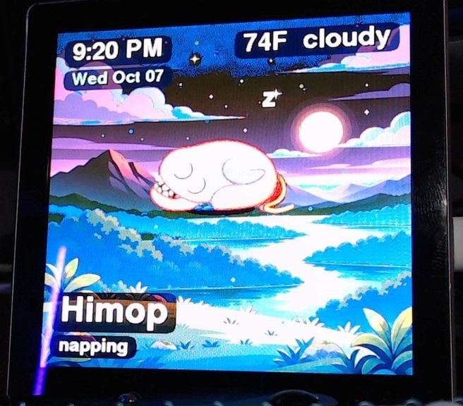

# Himop desk pet

A small desk pet for the Guition ESP32-4848S040, a 4-inch 480×480 touch screen. Himop soars over a landscape that changes with the time of day. He naps, nibbles, sometimes walks, and roars when a kooker shows up. The screen also shows the clock, the date, and the current weather.

<p align="center">
  
  &nbsp;
  
</p>

## Credit

**Himop was created by Silas Rangel as part of his _Creature Adventure Series_.** The character, his story, and his poses come from Silas. This project only puts him on a little screen. Thank you, Silas, for Himop.

## Meet Himop

<p align="center">
  
</p>

Himop is a herbivore people ride. He's about 12 feet 6 inches tall, and he flies more than he walks. He doesn't talk. His only sound is a loud "ROW, ROW, ROW" when a kooker threatens him. A tap on the screen is a pet, not a threat. It makes him happy, and it wakes him first if he was napping.

What he does on screen:

| Caption | What it means |
| --- | --- |
| soaring | Floats around the sky, cycling the six flying poses |
| napping | Curls up with his eyes closed and a drifting "z" |
| on foot | Walks, rarely, alternating two step poses |
| nibbling | Bites leaves, chews, then looks full |
| kooker! | A kooker appears; he roars and flies away from it |
| enjoys that | You petted him |

## Sprites

The poses live on the SD card at `/byte/sprites/0.bin`–`17.bin`. The PNGs below are made from those same files.

| | | | |
| :---: | :---: | :---: | :---: |
| <br>`0` Idle, mouth open | <br>`1` Idle, mouth closed | <br>`2` Flying | <br>`3` Flying angled |
| <br>`4` Walking 1 | <br>`5` Walking 2 | <br>`6` Sleeping | <br>`7` Happy |
| <br>`8` Threatened (the roar) | <br>`9` Eating | <br>`10` Chewing | <br>`11` Finished eating |
| <br>`12` Flying cycle 1 | <br>`13` Flying cycle 2 | <br>`14` Flying cycle 3 | <br>`15` Flying cycle 4 |
| <br>`16` Flying cycle 5 | <br>`17` Flying cycle 6 | | |

## Landscapes

The clock picks the background.

| Morning, 5:00–11:59 | Afternoon, 12:00–4:59 | Evening, 5:00–8:59 | Night |
| :---: | :---: | :---: | :---: |
|  |  |  |  |

## Hardware

| Item | Value |
| --- | --- |
| Board | Guition ESP32-4848S040 |
| MCU | ESP32-S3, 16 MB flash, 8 MB PSRAM (N16R8) |
| Panel | 4.0 inch, 480×480, ST7701, 16-bit RGB565 |
| Touch | GT911 |
| Storage | microSD (TF) card, FAT32, in the slot above the USB port |
| USB serial | CH340 |

## Build and flash

The project uses PlatformIO with the pioarduino platform (Arduino 3 / ESP-IDF 5) and LovyanGFX.

1. For weather, create `include/secrets.h` with your Wi-Fi details. Git ignores this file.

   ```cpp
   #define WIFI_SSID "your-network"
   #define WIFI_PASS "your-password"
   ```

2. Build and flash. Change the port to match your board.

   ```bash
   pio run -t upload --upload-port /dev/tty.usbserial-12430
   pio device monitor --port /dev/tty.usbserial-12430 --baud 115200
   ```

   If the upload can't reset the board, hold BOOT, tap RESET, release BOOT, and run the upload again.

## SD card

Copy the `sdcard/byte/` folder to the root of a FAT32 card, put the card in the board, and power-cycle it.

```
/byte/settings.txt      name, hold_ms, description
/byte/phrases.txt       read, but Himop doesn't speak them
/byte/pet.txt           read, but Himop doesn't speak them
/byte/sprites/0-17.bin  poses (width, height, RGB565 pixels, 1-bit mask)
/byte/bg/*.bin          480×480 RGB565 landscapes
```

Without a card, the board still runs. It shows built-in Himop art on a dark grid.

## Project layout

| Path | What it holds |
| --- | --- |
| `src/main.cpp` | Behavior, drawing, labels, touch |
| `src/lgfx_board.hpp` | Panel, touch, and backlight setup for this board |
| `src/sd_store.cpp` | Loads settings, sprites, and landscapes from the card |
| `src/weather.cpp` | Wi-Fi, clock, and current weather from Open-Meteo |
| `src/himop_art.cpp` | Built-in fallback art |
| `sdcard/byte/` | Files to copy onto the SD card |
| `docs/images/` | README screenshots and sprite PNGs |
| `pickupandgo.md` | Running build log and troubleshooting notes |
