# Himop desk pet

A small desk pet for the Guition ESP32-4848S040, a 4-inch 480×480 touch screen. Himop lives his own life over a landscape that changes with the time of day. He soars, explores off the edges and peeks back in, nibbles, naps when left alone, and roars when a kooker shows up. Tap the screen and he comes over to enjoy the attention. The screen also shows the clock, the date, and the current weather.

<p align="center">
  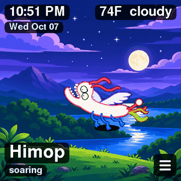
  &nbsp;
  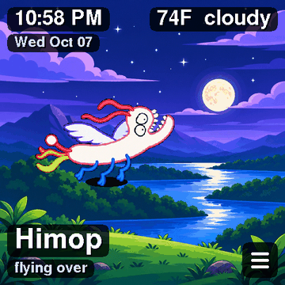
</p>

Every screenshot here is a pixel-exact dump of the board's framebuffer (see [Screenshots](#screenshots)).

## Credit

**Himop was created by Silas Rangel as part of his _Creature Adventure Series_.** The character, his story, and his poses come from Silas. This project only puts him on a little screen. Thank you, Silas, for Himop.

## Meet Himop

<p align="center">
  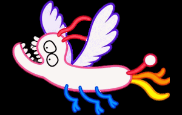
</p>

Himop is a herbivore people ride. He's about 12 feet 6 inches tall, and he flies more than he walks. He doesn't talk. His only sound is a loud "ROW, ROW, ROW" when a kooker threatens him. A tap on the screen is a pet, not a threat. He comes over to where you touched, and once he's there he enjoys it.

What he does on screen:

| Caption | What it means |
| --- | --- |
| soaring | Flies around the sky, cycling the six flying poses. Sometimes climbs out the top of the screen. |
| exploring | Leaves out a side or the bottom, stays out of view for a few seconds, then comes back in from any edge |
| peeking | While he's away, eases part way in from an edge, looks around for a few seconds, and slips back out |
| napping | After 5 minutes without a touch, curls up for a 30-minute nap with a floating "z". He only sleeps on screen: if he's away, he walks back in first ("walking back"). A touch wakes him. |
| on foot | Walks, rarely, alternating two step poses |
| nibbling | Bites leaves, chews, then looks full |
| kooker! | A kooker appears; he roars and flies away from it |
| waking up, flying over, walking over | You tapped. He comes to where you touched: he walks if he was on the ground, flies otherwise, and finishes waking first if he was napping. |
| enjoys that | He's arrived. Happy pose and hearts while you keep petting. Petting also keeps him on screen: the first tap gives 30 seconds and each extra tap adds 10 (up to 5 minutes). He keeps doing his own thing, but doesn't explore or fly off-screen during that time. |

He also has depth. Flying, he drifts nearer and farther and grows or shrinks between half and full size. When you call him, he comes right up close.

## Screenshots

| | | |
| :---: | :---: | :---: |
| 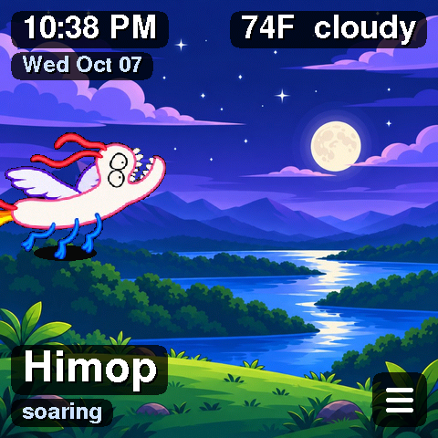<br>soaring | 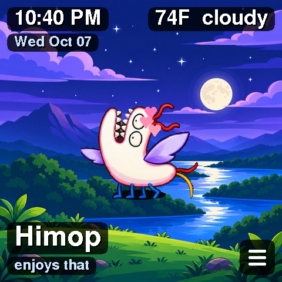<br>enjoys that | 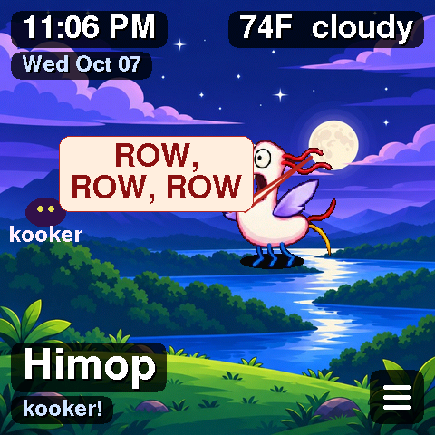<br>kooker! |
| 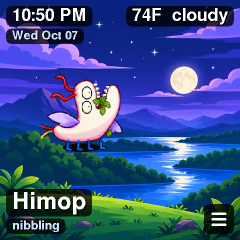<br>nibbling | 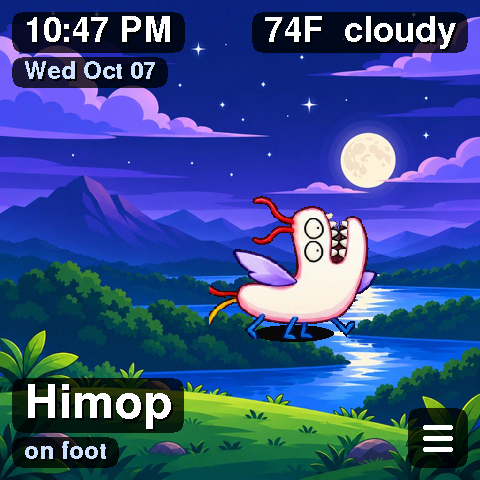<br>on foot | 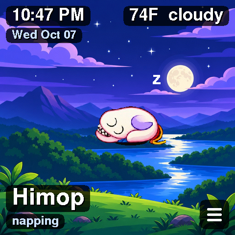<br>napping |
| 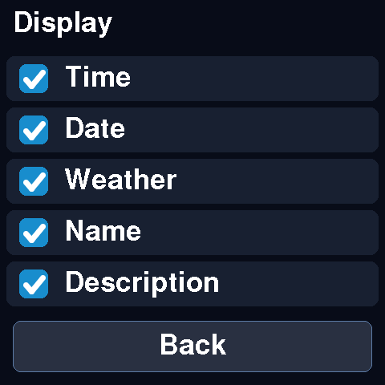<br>display options (☰ menu) | | |

| Kooker | Nap |
| :---: | :---: |
| 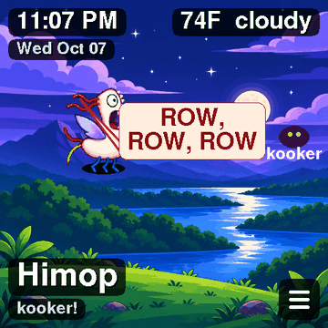 | 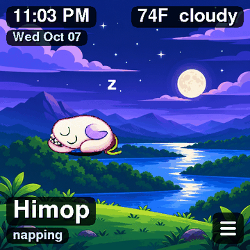 |

To capture your own, connect the board over USB and use `tools/capture.py` (needs `pyserial`, `numpy`, `Pillow`). The firmware dumps its 480×480 canvas over serial with checksummed chunks, and `rec` steps the animation on a fixed 33 ms clock so GIFs play at real speed:

```bash
python3 tools/capture.py /dev/tty.usbserial-12430 shot soaring.png act soar wait 2
python3 tools/capture.py /dev/tty.usbserial-12430 rec 30 soaring.gif act soar wait 2
```

## Settings menu

Tap the ☰ button in the lower-right corner. The menu shows the current Wi-Fi network and whether it's connected.

### Display

Tap **Display** to show or hide each label: **Time**, **Date**, **Weather**, **Name**, and **Description** (the line under his name that says what he's doing). Choices are saved in flash and survive a reboot.

### Wi-Fi

1. Tap **Choose network**. The board scans and lists nearby networks, strongest first. A padlock marks networks that need a password. Use **More** for the next page and **Other** for a hidden network.
2. Tap a network, type its password on the on-screen keyboard (**#+=** switches to symbols), and tap **Save**.
3. The menu shows "Connecting ..." and then the board's IP address. Tap **Close** to go back to Himop.

The board saves these credentials in flash (NVS), so they survive a reboot and override `include/secrets.h`.

## Sprites

The poses live on the SD card at `/byte/sprites/0.bin`–`17.bin`. The PNGs below are made from those same files.

| | | | |
| :---: | :---: | :---: | :---: |
| 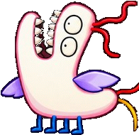<br>`0` Idle, mouth open | 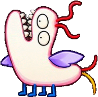<br>`1` Idle, mouth closed | 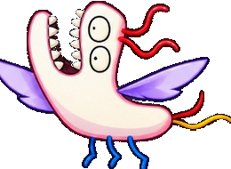<br>`2` Flying | 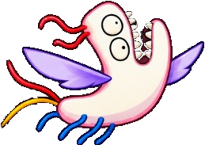<br>`3` Flying angled |
| 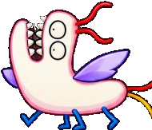<br>`4` Walking 1 | 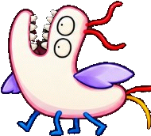<br>`5` Walking 2 | <br>`6` Sleeping | 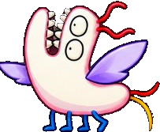<br>`7` Happy |
| 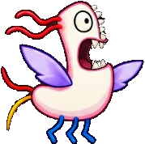<br>`8` Threatened (the roar) | 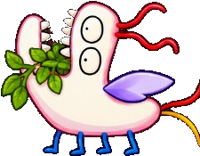<br>`9` Eating | 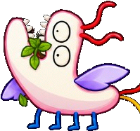<br>`10` Chewing | <br>`11` Finished eating |
| 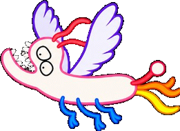<br>`12` Flying cycle 1 | 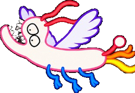<br>`13` Flying cycle 2 | 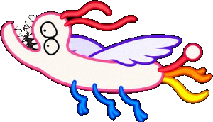<br>`14` Flying cycle 3 | 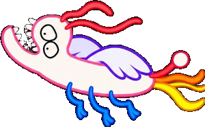<br>`15` Flying cycle 4 |
| 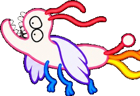<br>`16` Flying cycle 5 | 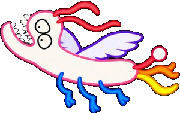<br>`17` Flying cycle 6 | | |

## Landscapes

The clock picks the background.

| Morning, 5:00–11:59 | Afternoon, 12:00–4:59 | Evening, 5:00–8:59 | Night |
| :---: | :---: | :---: | :---: |
|  |  |  |  |

## Hardware

| Item | Value |
| --- | --- |
| Board | Guition ESP32-4848S040 |
| MCU | ESP32-S3, 16 MB flash, 8 MB PSRAM (N16R8) |
| Panel | 4.0 inch, 480×480, ST7701, 16-bit RGB565 |
| Touch | GT911 |
| Storage | microSD (TF) card, FAT32, in the slot above the USB port |
| USB serial | CH340 |

## Build and flash

The project uses PlatformIO with the pioarduino platform (Arduino 3 / ESP-IDF 5). ESP-IDF's RGB panel driver runs the screen with bounce buffers, which keeps the picture steady while Wi-Fi is busy. LovyanGFX draws the frames and reads the touch panel.

1. Optional: to have Wi-Fi details built in, create `include/secrets.h`. Git ignores this file. You can skip this step and set Wi-Fi from the on-screen menu instead.

   ```cpp
   #define WIFI_SSID "your-network"
   #define WIFI_PASS "your-password"
   ```

2. Build and flash. Change the port to match your board.

   ```bash
   pio run -t upload --upload-port /dev/tty.usbserial-12430
   pio device monitor --port /dev/tty.usbserial-12430 --baud 115200
   ```

   If the upload can't reset the board, hold BOOT, tap RESET, release BOOT, and run the upload again.

## SD card

Copy the `sdcard/byte/` folder to the root of a FAT32 card, put the card in the board, and power-cycle it.

```
/byte/settings.txt      name, hold_ms, description
/byte/phrases.txt       read, but Himop doesn't speak them
/byte/pet.txt           read, but Himop doesn't speak them
/byte/sprites/0-17.bin  poses (width, height, RGB565 pixels, 1-bit mask)
/byte/bg/*.bin          480×480 RGB565 landscapes
```

Without a card, the board still runs. It shows built-in Himop art on a dark grid.

## Project layout

| Path | What it holds |
| --- | --- |
| `src/main.cpp` | Behavior, drawing, labels, touch |
| `src/board.hpp` | Pins, panel timing, and the ST7701 init commands |
| `src/display_rgb.cpp` | Panel driver (bounce buffers, vsync-timed updates) and GT911 touch |
| `src/sd_store.cpp` | Loads settings, sprites, and landscapes from the card |
| `src/weather.cpp` | Wi-Fi, saved credentials, clock, and current weather from Open-Meteo |
| `src/wifi_menu.cpp` | Settings menu: display checkboxes, Wi-Fi scan, and keyboard |
| `src/himop_art.cpp` | Built-in fallback art |
| `sdcard/byte/` | Files to copy onto the SD card |
| `docs/images/` | README screenshots and sprite PNGs |
| `tools/capture.py` | Pixel-exact screenshots and GIFs over serial |
| `pickupandgo.md` | Running build log and troubleshooting notes |
